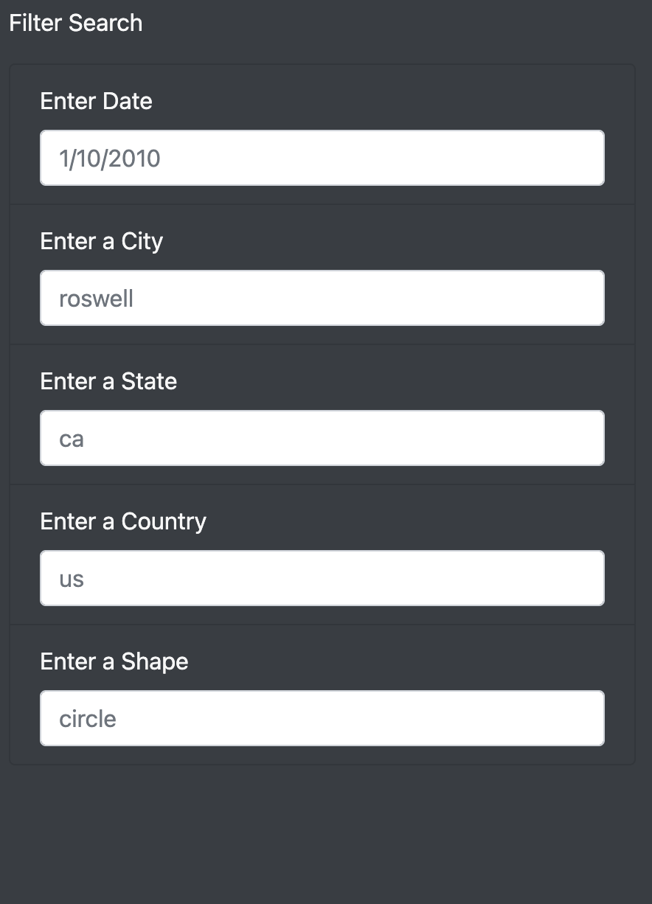
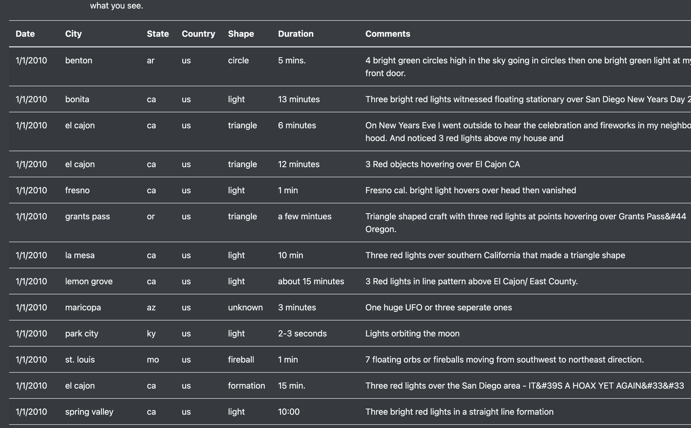
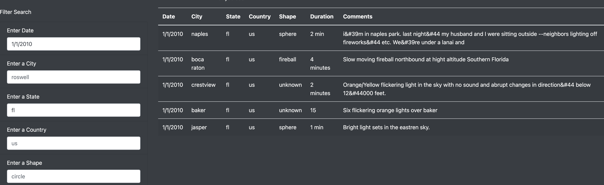

# UFOs
## Overview of Projec
Dana want to create a webpage and dynamic table to help ueser easily to get UFO sightings bu filtering for multiple criteria at the same time.

## How to use the website
First, Dana use a table to show the UFO sightings:

Then we use filter for multiple criteria:

Finally, we can get the insight that we want:

## Summary

### The summary addresses one drawback of this webpage
This fliter must use the word is exactly same as the table.Ex: The table use date is 1/1/2010. If we use the 01/01/2010, the result is none. 
### Two improvements
1. Add a latest news section to show the most recent sightings.
2. The filters should be to allow for upper and lower cases to search.

